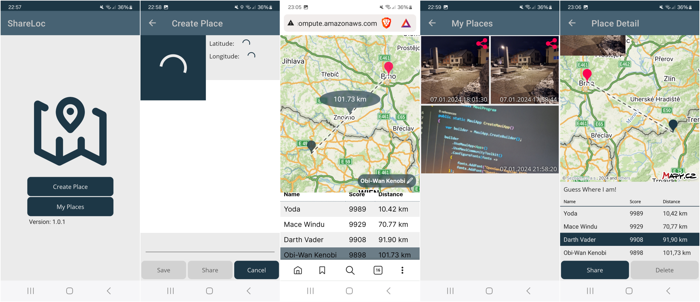

# ShareLoc

The mobile application provides the ability to take a picture and share it with anyone who can than guess the location of the picture in browser.

1) Take a picture
2) Share it via URL
3) Wait for others' guesses
4) Check others' guesses

The application was originally created for the [Application Development for Mobile Devices](https://www.fit.vut.cz/study/course/TAMa/.en) course (2023) at [BUT FIT](https://www.fit.vut.cz/.en).
